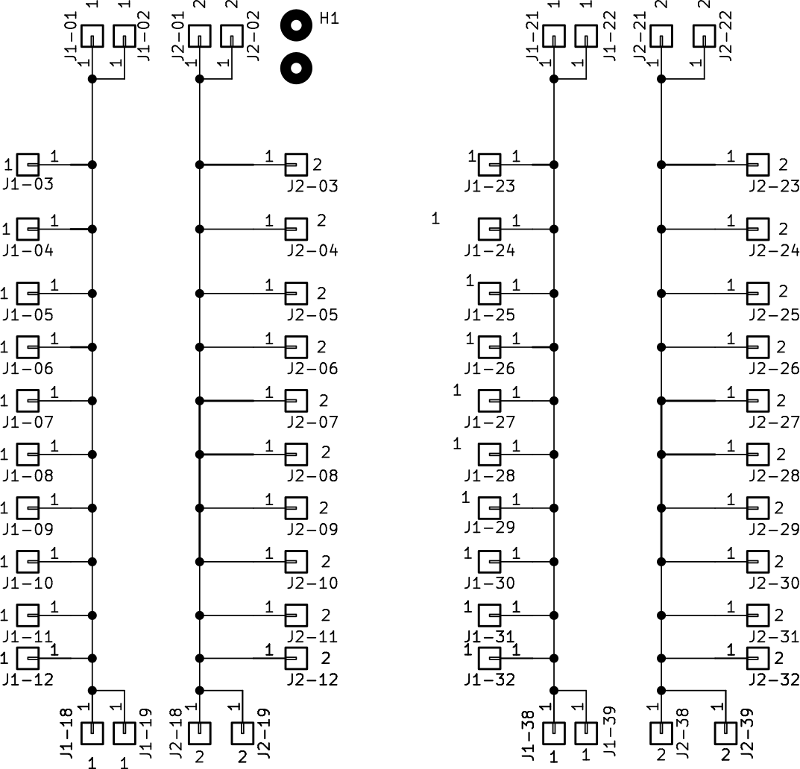

# Beschreibung

Platine, die die Verkabelung vereinfachen kann. Nutzbar, um 12V oder Fahrstrom zu verteilen.

Es können auch mehrere dieser Platinen miteinander verbunden werden.

Auf der Bestückungsseite(Oberseite) liegt der eine Pol oben, der andere oben.

Auf der Unterseite liegen die beiden Pole jeweils nebeneinander.

# Schaltplan

# Bestückungsplan

