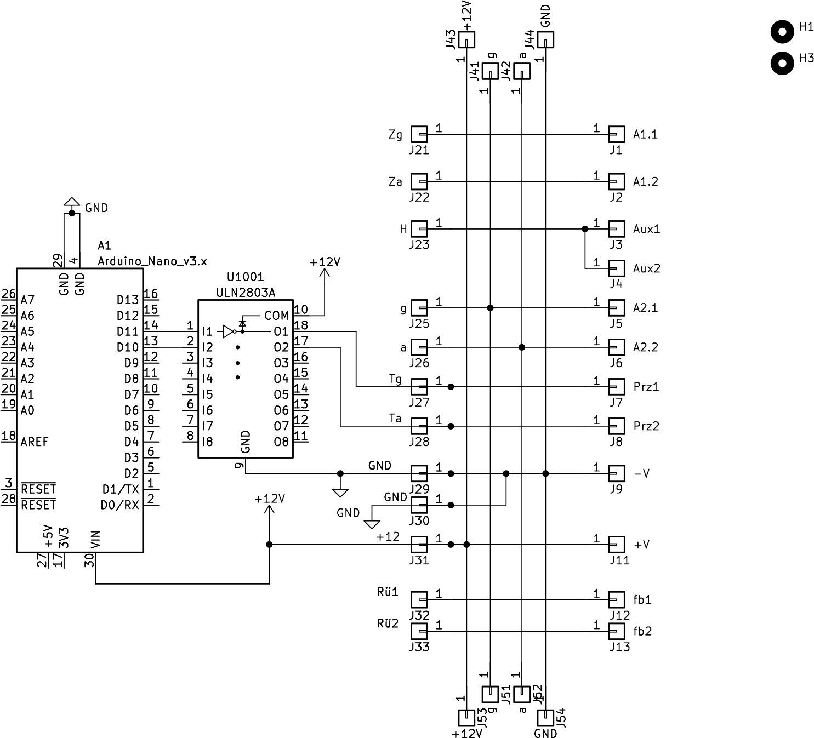

# Beschreibung

Platine, die die Verkabelung des Weichenantriebs MP6 von MTB vereinfachen soll.

Die 12V-Versorgung sowie das DCC-Signal kann einfach von Modul zu Model geführt werden.

# Schaltplan

# Bestückungsplan

